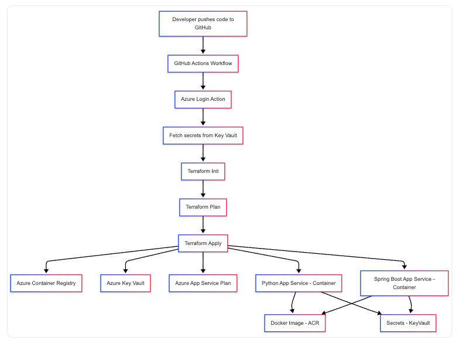

# DevOps Technical Challenge – Azure Deployment

## 🎯 Objective

Set up a development environment in Azure and deploy two containerized backend applications (one in Python, one in Spring Boot), making both publicly accessible and exposing their respective Swagger UIs.

---

## 🔧 Task Description

- Provision a complete **DEV environment in Azure**.
- Build Docker images for both **Python** [link](https://github.com/rc-ctream/hello-python) **Spring Boot** [link](https://github.com/rc-ctream/schoolar) backends.
- Deploy both applications to Azure.
- Implement a **CI/CD pipeline** that fully automates the build and deployment process.
- Ensure that both applications are publicly accessible and that their Swagger documentation is reachable via browser.

---

## 📌 Requirements

- Infrastructure should be provisioned using **Infrastructure-as-Code**.
- The build and deployment process must be **automated**.
- Both services should be exposed via public **URLs**.
- Swagger UIs must be accessible for both services.

---

## 📄 Deliverables

Please provide:

- A brief documentation of your architecture and deployment setup (via text, diagram, or code comments)
- Public URLs of both applications
- Optionally: known limitations or potential improvements

---

## ⏱ Timeframe

- Estimated effort: **3–5 hours**

---

## 🚀 Good luck!


_______________________________________________________________________________________________

# Azure DevOps Terraform Deployment

This project deploys a cloud infrastructure on Azure using Terraform and GitHub Actions CI/CD.

## 🔥 Components:

- **Resource Group** (`dev-rg`)
- **Key Vault** (`dev-kv-WcuDo123`) — stores secrets
- **Azure Container Registry** (`devacr12345`)
- **App Service Plan** (Linux B1)
- **Two Linux Web Apps:**
    - Python app: Docker image from ACR
    - Spring Boot app: Docker image from ACR
- **RBAC Assignments:**
    - Managed identity → AcrPull
    - Managed identity → Key Vault access

## 🛠️ Workflow:

- Uses **GitHub Actions** to automate:
  - Terraform init
  - Terraform validate
  - Terraform plan
  - Terraform apply
- Fetches secrets dynamically from Azure Key Vault
- No hardcoded credentials/secrets in code

## 🚀 Usage:

1. Clone repo
2. Configure `AZURE_CREDENTIALS` secret in GitHub
3. Push to `main` branch → CI/CD pipeline will deploy infra

## 📎 Outputs:

Terraform will print URLs of deployed apps after `terraform apply`:

```bash
Outputs:

python_app_url = <python app URL>
spring_app_url = <spring app URL>


## Architecture Diagram



